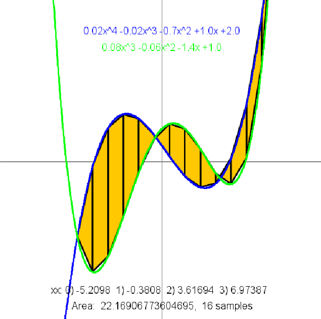

This repository deals with a polynomial equations represented as arrays where each degree is stored in a way that the position in the array is the degree of the part.
example:
-5x^3 +3x +1
would be represented as the array: {1,3,0,-5}
this format is the standard for all functions.
function input cannot contain an invalid array (arrays with the highest degree being 0(example: {1,3,0}))
List of functions:
double f (double[] poly, double x)
returns the y value in a given x for a polynomial function

double root_rec (double[] p, double x1, double x2, double eps)
returns the x of the functions where it touches the x-axis (y=0) within a given range

double[] PolynomFromPoints(double[] xx, double[] yy)
returns an array containing a polynomial function that passes through the 1-3 given points

boolean equals(double[] p1, double[] p2)
returns true if given 2 functions that return the same coordinates at given values based on their largest degree

String poly(double[] poly)
returns a string representing a polynomial function from a given array, example: {0,1,2,3} -> 3.0x^3 +2.0x^2 +1.0x

double sameValue(double[] p1, double[] p2, double x1, double x2, double eps)
returns the x coordinate of when two polynomial functions meet in a given range (Assuming there is one)

double length(double[] p, double x1, double x2, int numberOfSegments)
returns the length of a polynomial function in a given range by using a specific amount of lines to check

double area(double[] p1,double[]p2, double x1, double x2, int numberOfTrapezoid)
returns the area trapped between two functions using the Midpoint Riemann Sum Implementation

double[] getPolynomFromString(String p)
not done

double[] add(double[] p1, double[] p2)
returns an array that's the sum value of two polynomial functions

double[] mul(double[] p1, double[] p2)
returns an array that's the product value of two polynomial functions

double[] derivative (double[] po)
returns an array that represents the derivative of the provided polynomial function

double vectorLength (double x1, double y1, double x2, double y2)
returns the distance between two coordinates

double[] integral (double[] arr) - unused
returns an array that represents the integral of the provided polynomial function with the 0 spot as 0

double pow (double a, double b)
returns the power of two given numbers given the exponent is a positive integer

double[] shave(double a[])
this function returns an array after removing floating empty slots if they were the highest degree (if there were any)

